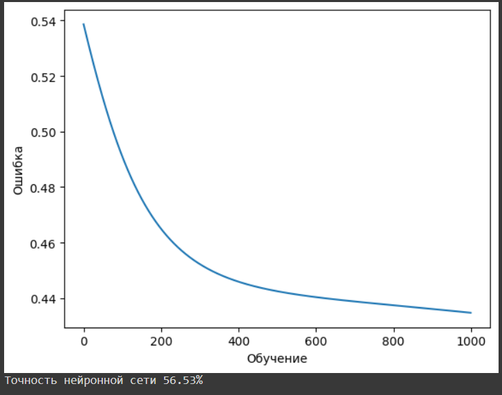
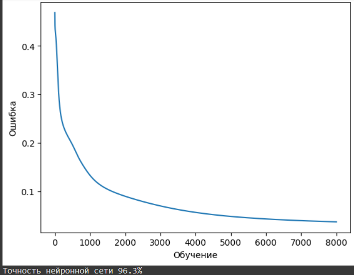

### Параметры нейронной сети.

Изучим тестовую нейронную сеть.

Так как мы не занимаемся прототипированием данных, а работаем с уже готовым датасетом - то у нас есть четыре признака:
- SepalLengthCm
- SepalWidthCm
- PetalLengthCm
- PetalWidthCm

Потому к нас будет четыре элемента для входного слоя.
Пять нейронов скрытого слоя. И три выходных.

Мы не будем менять архитектуру нейронной сети, потому мы можем повлиять только на масштабирование изначального распределения весов
в 81-82 строчке кода:

w0 = __коэф__*np.random.random((4, 5)) - 1

w1 = __коэф__*np.random.random((5, 3)) - 1

Второй изменяемый параметр это скорость обучения (learning rate). Базово он равен 0.001

Третьим варьируемым параметром являются эпохи обучения. В данном примере это итерации с параметром  равным 1000

Четвертым параметром изучаемой нейросети является выбор активационной функции. Это один из важнейших параметров для работы нейросети и его выбор зависит от множества факторов:
- от задачи которую должна выполнять нейросеть
- от выбранной архитектуры
- от датасета и его обработки

Обучение будет производится с использованием методов прямого и обратного распространения меотдом градиентного спуска без модификаицй.
Мы не будем как от изменять эти параметры.

### Базовая эффективность :
Результат обучения на стартовых параметрах составил от 55.53% до 56.8% в нескольких запусках обучения.
Средний результат показан в файле base_res.png

### Результаты оптимизации.

Изменение масштабирования изначальных весов приводит к снижению эффективности нейросети. А уменьшения масштаба меньше 100% вообще приводит к нарастанию ошибки с эпохами обучения.
Увеличение этого параметра приводит к незначительному увеличению эффективности. Притом если повысить количество эпох обучения то эффект от этого параметра различим только на скорости начального эпата обучения в первых 10%-15% от количества итераций обучения.

Уменьшение learning rate для исходного количества эпох приводит к снижению эффективности обучения до 49%, что уже случайного угадывания.
Если же увеличить количество эпох обучения, то эффективност растет. Вопрос целесообразности такого расхода вычислительных ресурсов нужно изучать дополнительно.

Куда эффективней оказалось увеличение скрорости обучения. Изменение этого параметра от 0.001 до 0.3 даже на 1000 итераций обучения повысило эффективность до 84%

Дальнейшее увеличение скорости обучения привело к неоднозначным резульататам. С одной стороны для данного датасета это привело в отдельных случаях к увеличению эффективности до 96%.
Однако вариативность исходов обучения нейросети резко выросла. Разброс итогов менялся от 62% до 96%.

Увеличение скорости обучения выше 0.06 выглядит нецелесообразным из-за вариативности и неустойчивости резульатов обучения. 
Это может быть полезным только в случае малых вычислительных мощностей для обучения нейросети, когда в некоторых вариантах такой подход дает лучшую точность.Хотя сам факт нестабильности результатов даже для такой примитивной задачи подсказывает что увеличивать шаг скорость обучения выше 0.3-0.6 не целесообразно.

Последним изменяемым параметром является количество итераций обучения. Выше мы уже изменяли этот параметр и определяли его эффект в совокупности с параметром скорости обучения.
Здесь наблюдается прямая зависимость эффективности обучения от количества эпох обучения, особенно для низких показателей скорости обучения, ниже 0.01.
Однако это самый затратный способ повышения эффективности обучения. Даже для тестовой простой задачи повышение этого параметра выше 500000 итераций загружает вычислительные мощности на продолжительное время.

### Выводы.

Наибольшую эффективность показали параметры скорости обучения и количество эпох обучения -  притом они связаны между собой ,особенно для низких параметров скорости обучения.

Максимально эффективным и экономным оказалась совокупность параметров скорости обучения 0.3 и 8000 итераций обчучения.
При таких параметрах средняя эффектвиность нейросети всгеда превышала 95% - что в аналитике соответствует достоверности альфа 0.05 и достаточная точность для простых задач.
Результат в файле fin_res.png

Кратное увеличение эпох обучения приводит к неэффективному расходовонию вычислительных мощностей и не повышает итоговую эффективность в 95%-96%.

Так же был получен один аномальный результат обучения для высокого параметра скорости обучения в 0.3 , когда на 1000 эпохах был получен результат 96.7%.
Однако это стоит считать случайностью и примитивностью решаемой задачи.

